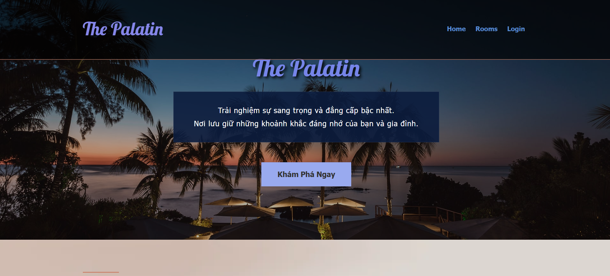

# 🏨 The Palatin - Hotel Management System

**The Palatin** là một ứng dụng web quản lý và đặt phòng khách sạn được xây dựng bằng **ReactJS**. Dự án cung cấp giao diện cho cả khách hàng (đặt phòng, xem lịch sử) và quản trị viên (quản lý phòng, quản lý đơn đặt).

---

## 🚀 Tính năng chính

### 👤 Dành cho Khách hàng (User)
* **Trang chủ:** Xem giới thiệu, banner động, các dịch vụ nổi bật.
* **Danh sách phòng:** Xem chi tiết các hạng phòng, lọc phòng.
* **Đặt phòng (Booking):**
    * Chọn ngày Check-in / Check-out.
    * Tự động tính toán tổng tiền dựa trên số đêm và số lượng phòng.
    * Điền thông tin cá nhân và yêu cầu đặc biệt.
* **Thanh toán:** Mô phỏng thanh toán qua QR Code, MoMo, PayPal hoặc thanh toán tại khách sạn.
* **Lịch sử đặt phòng:** Xem lại các đơn đã đặt, trạng thái thanh toán và thông tin chi tiết.

### 🛠 Dành cho Quản trị viên (Admin)
* **Dashboard:** Tổng quan hệ thống.
* **Quản lý Phòng (CRUD):** Thêm, Sửa, Xóa phòng khách sạn.
* **Quản lý Đơn đặt (Booking Management):**
    * Xem danh sách tất cả đơn đặt phòng.
    * Xem chi tiết ngày Check-in/Check-out.
    * Xóa các đơn đặt phòng.
    * Theo dõi trạng thái thanh toán.

---

## 🛠 Công nghệ sử dụng

* **Frontend:** ReactJS (Vite/Create React App)
* **Routing:** React Router DOM v6
* **State Management & Data:** LocalStorage (Giả lập Database)
* **Styling:** CSS3, Bootstrap 4/5, FontAwesome Icons.
* **Fonts:** Google Fonts (Lobster, Tahoma).
* **Notifications:** React Toastify.

---

## ⚙️ Hướng dẫn Cài đặt & Chạy dự án

Đảm bảo máy tính của bạn đã cài đặt **Node.js** (Phiên bản 14 trở lên).

### Bước 1: Clone dự án về máy
### Bước 2: Cài đặt các thư viện (Dependencies)
npm install
### Bước 3: Khởi chạy dự án
npm run dev